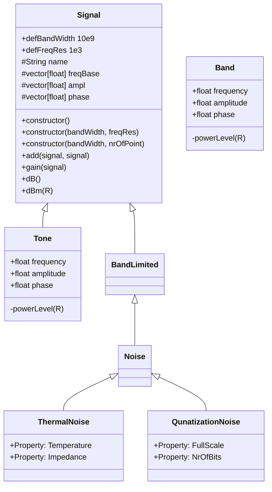

```mermaid
classDiagram
    Signal <|-- Tone
    Signal <|-- BandLimited
    BandLimited <|-- Noise
    Noise <|-- ThermalNoise
    Noise <|-- QunatizationNoise
    class Signal {
            +defBandWidth 10e9
            +defFreqRes 1e3
            #String name
            #vector[float] freqBase
            #vector[float] ampl
            #vector[float] phase
            +constructor()
            +constructor(bandWidth, freqRes)
            +constructor(bandWidth, nrOfPoint)
            +add(signal, signal)
            +gain(signal)
            +dB()
            +dBm(R)
    }
    class Noise{
    }
    class Tone{
      +float frequency
      +float amplitude
      +float phase
      -powerLevel(R)
    }
    class Band{
      +float frequency
      +float amplitude
      +float phase
      -powerLevel(R)
    }
    class ThermalNoise {
    +Property: Temperature
    +Property: Impedance
    }
    class QunatizationNoise {
    +Property: FullScale
    +Property: NrOfBits
    }     
```
