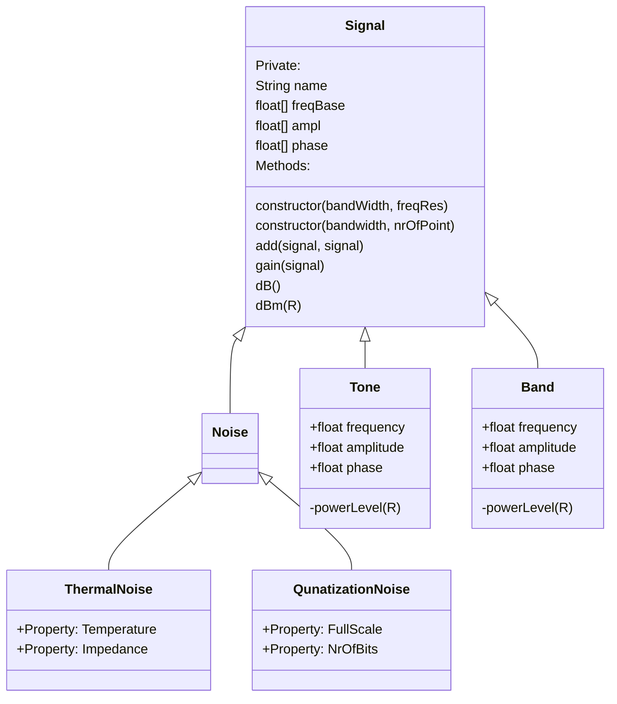

```mermaid
classDiagram
    Signal <|-- Noise
    Signal <|-- Tone
    Signal <|-- Band
    Noise <|-- ThermalNoise
    Noise <|-- QunatizationNoise
    class Signal {
        Private:
            String name
            float[] freqBase
            float[] ampl
            float[] phase
        Methods:
            constructor(bandWidth, freqRes)
            constructor(bandwidth, nrOfPoint)
            add(signal, signal)
            gain(signal)
            dB()
            dBm(R)
    }
    class Noise{

    }
    class Tone{
      +float frequency
      +float amplitude
      +float phase
      -powerLevel(R)
    }
    class Band{
      +float frequency
      +float amplitude
      +float phase
      -powerLevel(R)
    }
    class ThermalNoise {
    +Property: Temperature
    +Property: Impedance
    }
    class QunatizationNoise {
    +Property: FullScale
    +Property: NrOfBits
    }     
```
