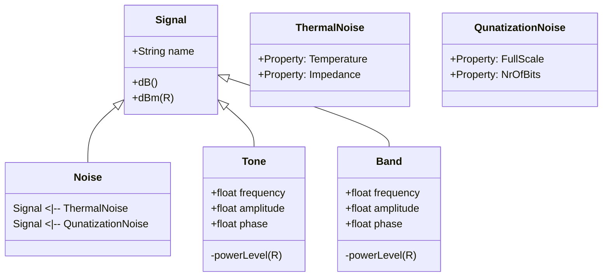

```mermaid
classDiagram
    Signal <|-- Noise
    Signal <|-- Tone
    Signal <|-- Band
    Signal: +String name
    Signal: +dB()
    Signal: +dBm(R)
    class Noise{
      Signal <|-- ThermalNoise
      Signal <|-- QunatizationNoise
    }
    class Tone{
      +float frequency
      +float amplitude
      +float phase
      -powerLevel(R)
    }
    class Band{
      +float frequency
      +float amplitude
      +float phase
      -powerLevel(R)
    }
    class ThermalNoise {
    +Property: Temperature
    +Property: Impedance
    }
    class QunatizationNoise {
    +Property: FullScale
    +Property: NrOfBits
    }     
```
