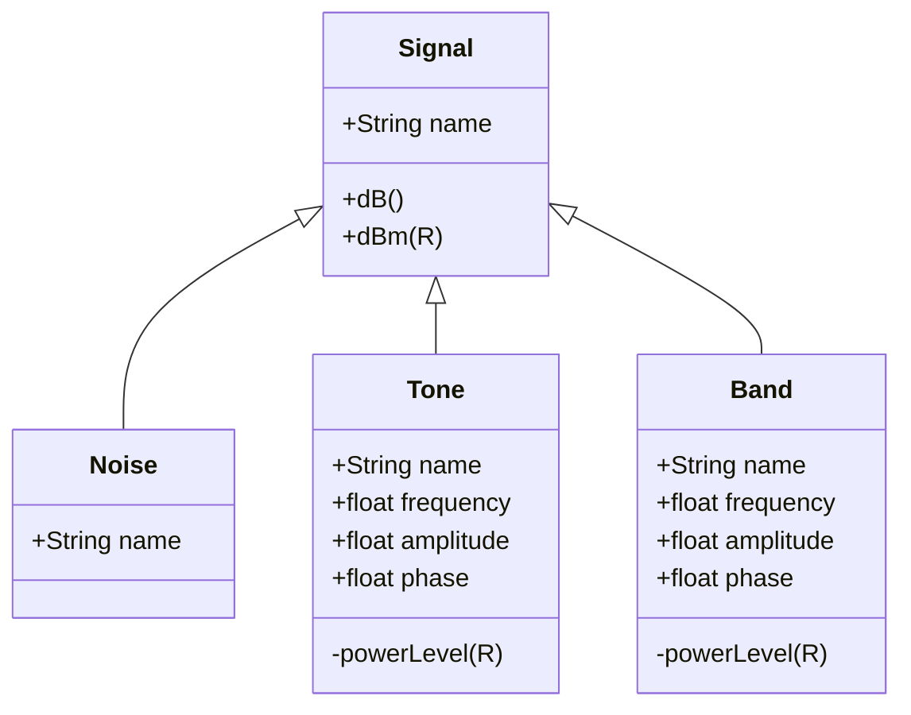

```mermaid
classDiagram
    Signal <|-- Noise
    Signal <|-- Tone
    Signal <|-- Band
    Signal : +String name
    Signal: +dB()
    Signal: +dBm(R)
    class Noise{
      +String name
    }
    class Tone{
      +String name
      +float frequency
      +float amplitude
      +float phase
      -powerLevel(R)
    }
    class Band{
      +String name
      +float frequency
      +float amplitude
      +float phase
      -powerLevel(R)
    }
```
